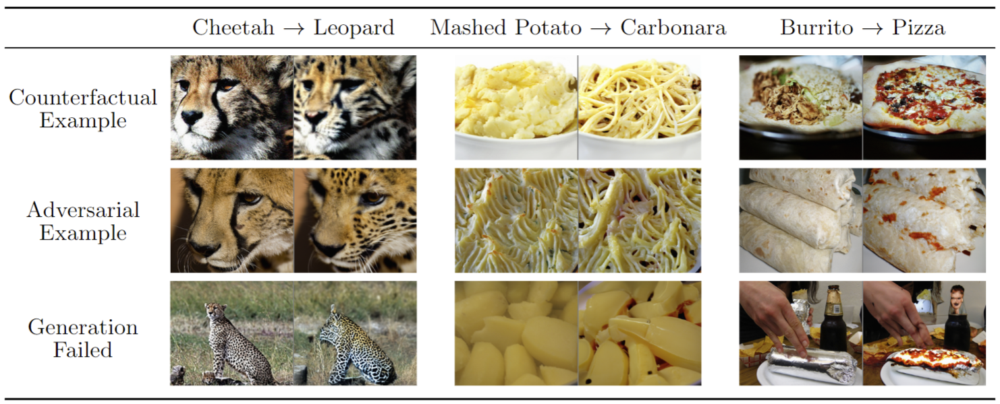

# DBVCE-Eval
This repository is based on [openai/guided-diffusion](https://github.com/openai/guided-diffusion), which is based on [openai/improved-diffusion](https://github.com/openai/improved-diffusion). We removed every component which is not necessary for this project and extended the codebase with our own code.

# Reproducing the results
The paper results can be reproduced with this repository.

1. Install the dependencies as described below.
2. Download the models as described below.
3. Run `run.sh` to sample the images *for one run*. The results will be uploaded to wandb. Note that you only have to adapt `classifier_class`, `cone_projection` and `xzero_prediction`.
   - You can also use `sweep.yml` to execute a wandb sweep. For this, call `wandb sweep sweep.yml` and then `wandb agent <sweep_id>`.  
4. Generate the tables from the paper using `analysis/generate_tables.ipynb` and a wandb csv export.
5. Generate the figures from the paper using `analysis/generate_figure_table.ipynb` and a wandb csv export.

## GPU Setup
Please note that this repository is intended to run on four A100 GPUs.
If you do not have this setup, you may have to adapt the lines of code which adapt `CUDA_VISIBLE_DEVICES`.

# Install
1. `git clone`
2. Install submodules `git submodule update --init --recursive`
3. Install dependencies using conda `conda env create -f environment.yml`
4. Download your desired Madry and UNET model and adapt `MODEL_BASE_PATH` in `classifiers/paths.py` accordingly.
   1. Madry: `cls_ResNet50_madry/l2_improved_3_ep.pt`
   2. UNET: `256x256_classifier.pt`, taken from the guided_diffusion repository paper.
   3. The other models will be downloaded automatically.
5. Download and extract the ImageNet dataset. In our repository, we used `/data/imagenet/`.

# Sampling
See `run.sh`, which contains the commands to run the sampling. 

The sampling is done in these steps:
1. For every image-target pair, sample the results guided by the classifier and calculate metrics.
2. Calculate oracle scores.
3. Deploy to wandb.